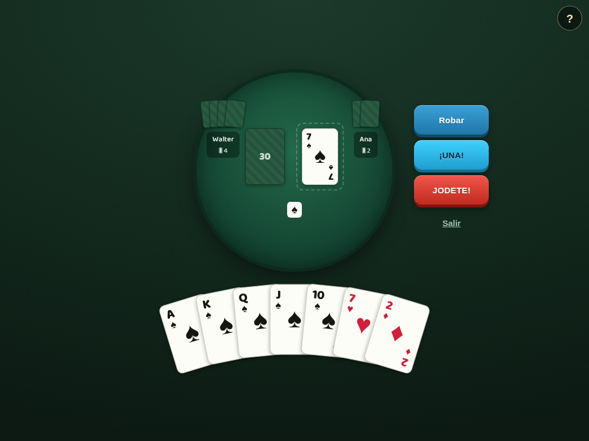
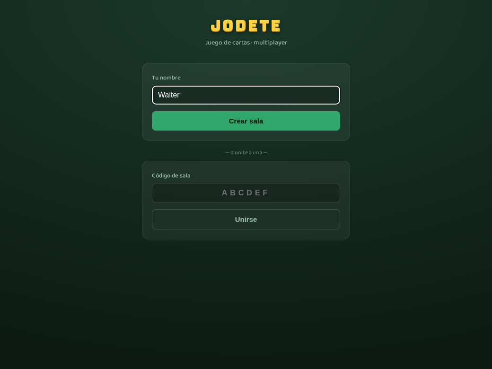
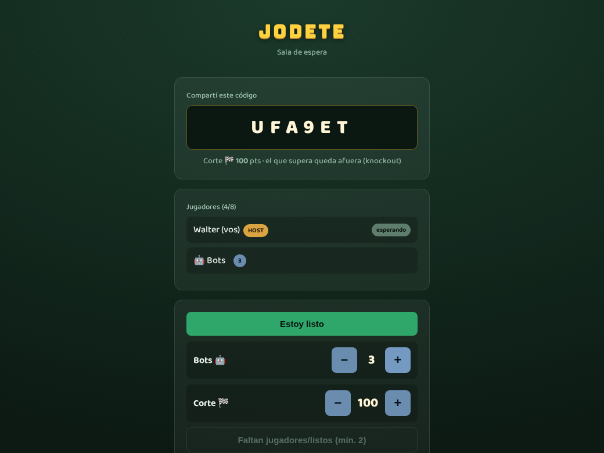
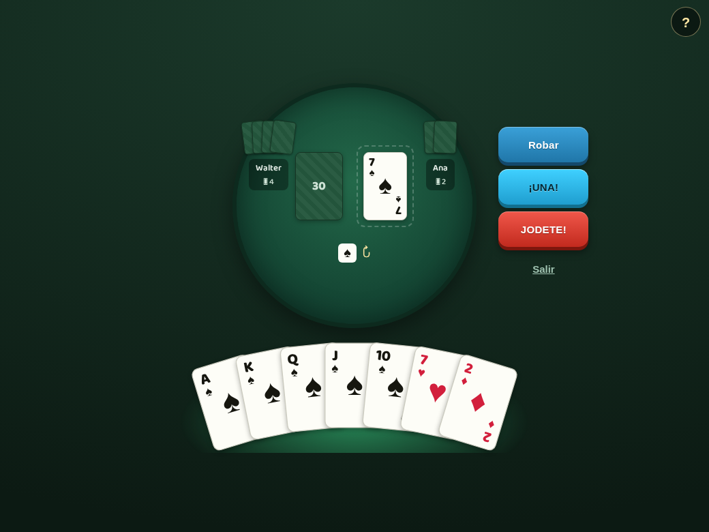

# Jodete 🃏

**Juego de cartas multiplayer online de velocidad** (2–8 jugadores), con acciones fuera de
turno resueltas por **orden de llegada al servidor**. Web, sin instalar nada, sin cuentas:
creás una sala, compartís el código y a jugar.

[](https://jodete.vercel.app)
[](./LICENSE)

🎮 **Jugá ya: https://jodete.vercel.app**



> Jodete es un juego de cartas popular en Argentina (primo del UNO / Crazy Eights), con
> "espejito", cantar **¡UNA!**, el **as de pic** y el grito de **¡JODETE!** para cazar al
> que jugó mal. Este es un prototipo jugable y completo del core.

---

## 📸 Capturas

| Inicio | Sala de espera |
|---|---|
|  |  |

| Mesa | Turno revelado (a los 10s de inactividad) |
|---|---|
|  |  |

---

## 🧱 Stack

Monorepo con **pnpm workspaces**:

- **`server/`** — Node.js + TypeScript + **Colyseus** (game-server autoritativo, rooms).
  El servidor es la **única fuente de verdad**: procesa los mensajes de cada sala de forma
  secuencial, así que "quién llegó primero" queda definido sin locks.
- **`client/`** — React + TypeScript + **Vite**. UI de mesa circular con drag & drop,
  animaciones y sonido (Web Audio, sin archivos).
- **`shared/`** — tipos, constantes, modelo de cartas y reglas compartidas.

Diseño completo (reglas, modelo de concurrencia, engine reversible, milestones) en
[`DESIGN.md`](./DESIGN.md).

---

## 🚀 Correr localmente

### Requisitos
- Node.js ≥ 20 (probado en 26)
- pnpm ≥ 9

### Setup
```bash
pnpm install
```

### Desarrollo
Levanta el server (`:2567`) y el client (`:5173`) juntos:
```bash
pnpm dev
```
Abrí `http://localhost:5173` en dos pestañas: creá una sala, copiá el código y unite desde
la otra.

### Jugar en varios dispositivos (misma red / LAN)
`pnpm dev` deja el server y el client escuchando en **todas las interfaces**. Al arrancar,
el server imprime las URLs LAN, por ejemplo:
```
[jodete]   LAN: ws://192.168.1.42:2567  (wlan0)
```
Desde otro dispositivo de la misma red (celular, otra compu) abrí:
```
http://<IP-DE-TU-COMPU>:5173      (ej: http://192.168.1.42:5173)
```
El cliente deriva el WebSocket del `hostname` con el que se lo abrió, así que apunta solo al
server correcto. (Podés forzar otro con `VITE_SERVER_URL`.)

### Bots 🤖
En el lobby, el host puede sumar bots hasta completar la mesa. Los bots:
- juegan una carta legal **en su turno** con ~3s de demora (o roban/pasan si no pueden);
- hacen **espejito** con esa misma demora cuando tienen la carta idéntica (pierden si un
  humano llega antes);
- **se equivocan ~2%** de las veces (tiran una carta ilegal, que queda challengeable);
- cantan **¡UNA!** solos.

Config por env: `JODETE_BOT_DELAY_MS` (default 3000), `JODETE_BOT_MISTAKE` (default 0.02).

---

## 🎯 Cómo se juega

El objetivo es **quedarte sin cartas** (cortar). Al cortar, cada rival suma los puntos de lo
que le quedó en mano; el que supera el umbral de corte queda afuera (knockout) hasta que
queda un ganador.

### Acciones
- **Jugar una carta**: en tu turno, **click**, doble-click o **arrastrala** al pozo. No hay
  botón "Jugar". Con 8 / comodín se abre un selector de palo.
- **Espejito** 🪞: si tenés una carta **idéntica** al tope, clickeala **aunque no sea tu
  turno** para adelantarte. Gana el más rápido (orden de llegada al server) y saltea al
  jugador de turno.
- **Robar / Pasar**: si no podés jugar, robá del mazo; después jugás o pasás.
- **¡UNA!**: cuando te queda **1 carta**, cantá UNA. Si a un rival le queda 1 y no lo dijo,
  apretá **"¡le queda 1!"** para hacerlo robar 3.
- **As de pic** (A♠): se resalta cuando hay un efecto en la mesa (2, 8, J, Q, K, comodín).
  Tocalo (aunque no sea tu turno) para **cancelar el efecto**: nadie roba, se revierte el
  salteo/K y vos robás 1.
- **¡JODETE!**: si creés que alguien jugó mal, gritá JODETE. Si tenías razón, el que jugó mal
  roba 3 y se revierte la jugada; si era válida, **vos** robás 3.

### Cartas y efectos
| Carta | Efecto |
|---|---|
| **2** | El siguiente roba 2 y es salteado. **Apilable** (2 sobre 2 → +2). |
| **8** | Elegís el palo; se puede tirar sobre cualquier carta. |
| **J** | Saltea al próximo. |
| **Q** | Saltea a los próximos 2. |
| **K** | Invierte el sentido de la ronda. |
| **Comodín** | El siguiente roba 4 y luego juega; quien lo tira elige palo. No admite espejito. |
| 3-4-5-6-7-9-10 | Sin efecto. |

### Puntaje (al cortar, suma lo que quedó en mano)
`2 = 20` · `3-7,9,10 = valor` · `8 = 30` · `J,Q,K = 10` · `As = 15` · `As de pic = 75` · `Comodín = 50`

### Detalles de diseño
- **El turno está oculto**: se revela (con un glow, sin texto) recién a los **10s** sin que
  nadie tire una carta. El **sentido** de la ronda (↻/↺) también aparece ahí — es info a
  deducir. Tu propio turno se te avisa al instante.
- **Regla de los 2s**: una jugada **ilegal** solo queda en pie (y challengeable) si pasaron
  ≥2s desde la carta anterior; si es más rápida, se rechaza en silencio y nadie la ve. Las
  jugadas legales y el espejito nunca se filtran.
- **Información oculta**: las manos ajenas nunca viajan al cliente; de los rivales ves solo
  la **cantidad** de cartas (dorsos).

---

## ✅ Tests

```bash
pnpm typecheck        # typecheck de los 3 paquetes
pnpm build            # build de producción
pnpm e2e              # Playwright: lobby, drag&drop, espejito, challenge (levanta todo solo)
```

---

## 🗺️ Estado

- [x] **Lobby** — crear/unirse por código, ready, bots, umbral de corte, kick
- [x] **Loop por turno** — reparto, mano privada, jugar por palo/número, multi-carta, robar,
      pasar, corte, puntaje acumulado, revancha
- [x] **Espejito** — jugada idéntica fuera de turno, instantánea, apila sobre 2s
- [x] **Efectos** — 2, 8, J, Q, K, comodín
- [x] **JODETE** (challenge reversible, ≤3 cartas arriba, roba 3) + **UNA** (cantar y acusar)
- [x] **As de pic** — cancela el efecto de la última carta
- [x] **UI de mesa** — mesa circular, animación de la carta al centro, sonido, turno oculto
- [ ] Pendiente: reconexión, multi-carta en la UI (el server ya la soporta)

---

## 🤝 Contribuir

Es un proyecto abierto y las contribuciones son bienvenidas. Antes de un cambio grande, abrí
un issue para conversarlo. Corré `pnpm typecheck` y `pnpm e2e` antes de mandar un PR.

## 📄 Licencia

[MIT](./LICENSE) © 2026 Ignacio Barbero. Usalo, forkealo y modificalo libremente.
